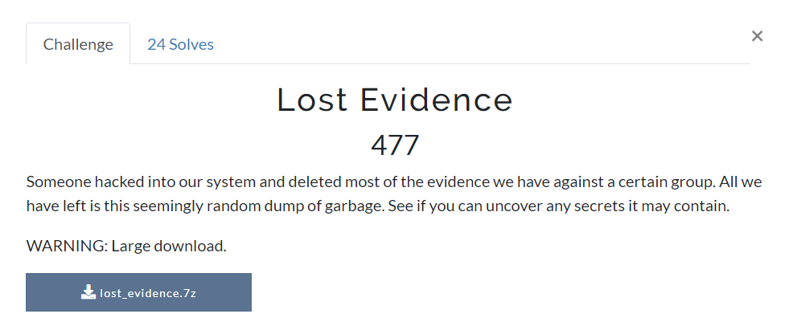
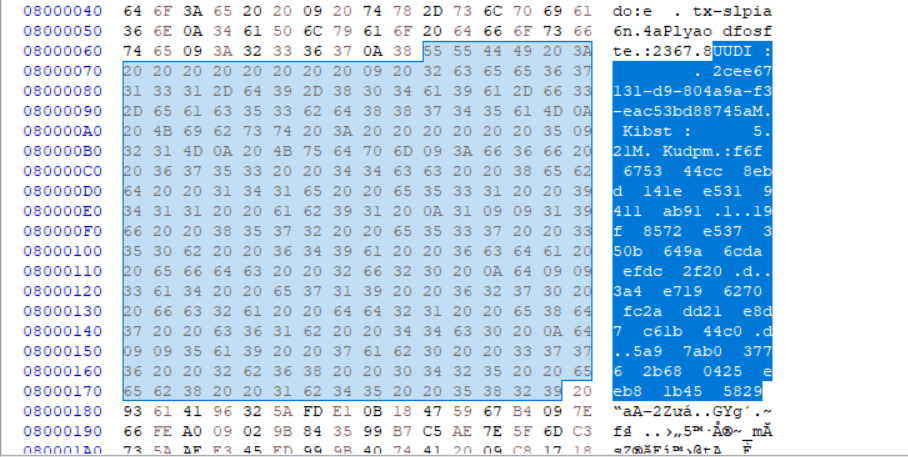
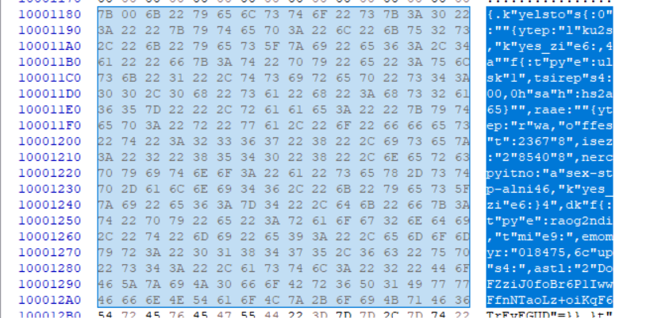
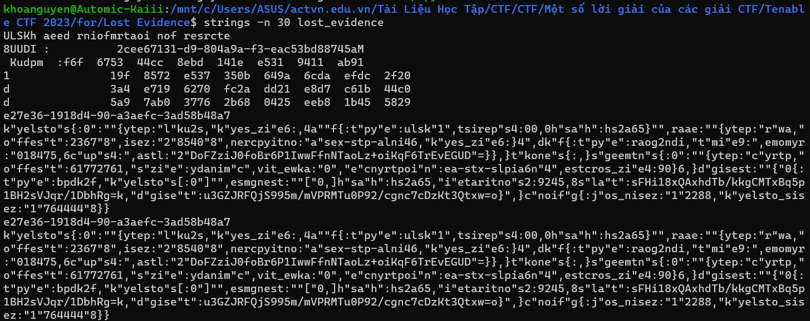
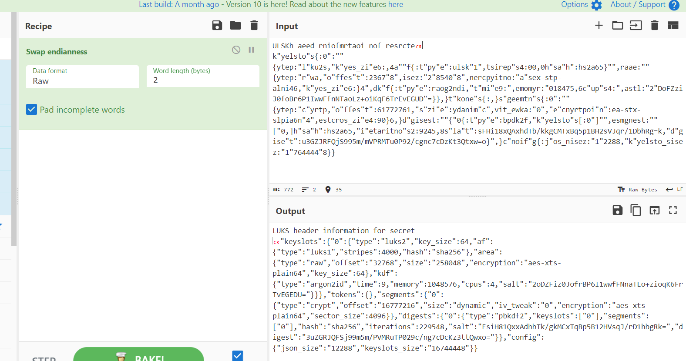
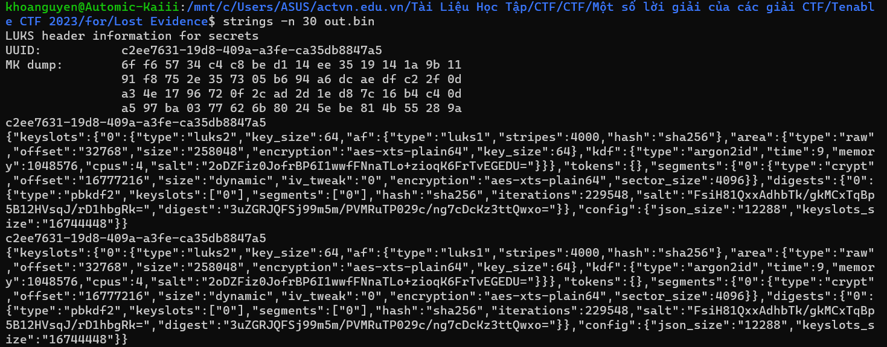
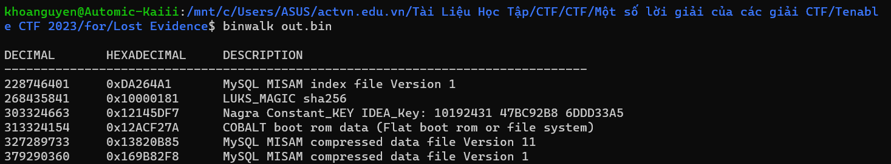
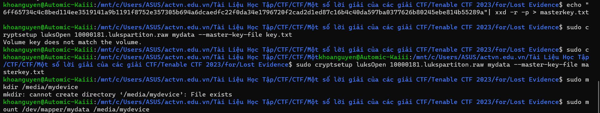
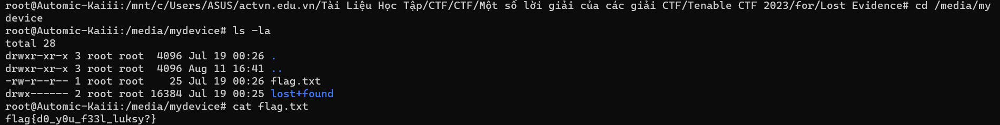

# Lost Evidence 

## Des :


```
Someone hacked into our system and deleted most of the evidence we have against a certain group. All we have left is this seemingly random dump of garbage. See if you can uncover any secrets it may contain.
```

## Sol : 

+ Khi dùng strings hay HxD để đọc nội dung file đề cung cấp thì mình nhận được 1 vài thứ đặc biệt 







=> file đã bị xáo trộn, mình check lại 1 lần để xem : 

 

=> Mình viết script để swap nó lại 

```
x = open("out.bin", "wb")

with open("lost_evidence", "rb") as f:
    while(data := f.read(2)):
        x.write(data[::-1])
```

+ Và sau khi sửa xong thì mình đã lấy lại 1 file hoàn chỉnh  : 



+ Tìm kiếm trên gg thì mình biết được nó liên quan đến `LUKS to encrypt a drive`  

+ Binwalk file thì mình nhận được 1 file LUKS_MAGIC sha256 : 



+ Oke bây giờ mình sẽ lấy phần vùng của luks : 

```
1. echo "6ff65734c4c8bed114ee3519141a9b1191f8752e357305b694a6dcaedfc22f0da34e1796720f2cad2d1ed87c16b4c40da597ba0377626b80245ebe814b55289a" | xxd -r -p > masterkey.txt (tạo file key)

2. sudo cryptsetup luksOpen 10000181.lukspartiton.raw  mydata --master-key-file masterkey.txt

+ sudo: Thực hiện lệnh dưới quyền người dùng "superuser" (người dùng có quyền hạn cao).
+ cryptsetup: Một tiện ích dòng lệnh để làm việc với các phân vùng mã hóa trên Linux.
+ luksOpen: Lệnh để mở một phân vùng đã mã hóa bằng LUKS.
+ 10000181.lukspartiton.raw: Tên tệp chứa phân vùng mã hóa.
+ mydata: Tên cho thiết bị mở (có thể đặt tên tùy ý).
+ --master-key-file masterkey.txt: Sử dụng tệp masterkey.txt chứa master key để mở phân vùng. Điều này giả định rằng master key đã được trích xuất từ nguồn gốc của nó.

3. sudo mkdir /media/mydevice (tạo thư mục với đường dẫn /media/mydevice ) 

4. sudo mount /dev/mapper/mydata /media/mydevice

+ mount: Lệnh để mount một thiết bị vào một thư mục trong hệ thống tệp.
+ /dev/mapper/mydata: Đây là thiết bị mapper đã mở từ phân vùng mã hóa bằng LUKS. Đây là tên được đặt trong lệnh cryptsetup luksOpen.(chạy `sudo blkid` và `sudo lsblk` để kiểm tra)
+ /media/mydevice: Đây là thư mục mà phân vùng được gắn kết. Sau lệnh này, nội dung của phân vùng mã hóa sẽ hiển thị trong thư mục này.

5. ls /media/mydevice (để xem các file chưa trong thư mục)
6. cat /media/mydevice/file_name (xem file_name muốn xem, ví dụ cat /media/mydevice/flag.txt)

```




#flag : `flag{d0_y0u_f33l_luksy?}`
