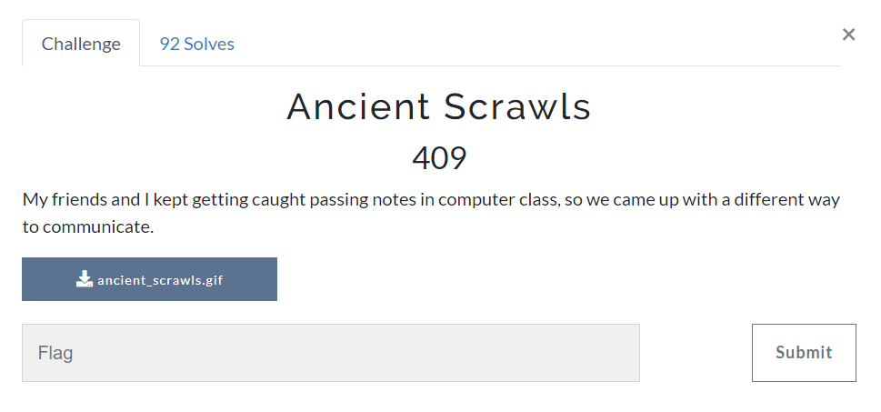

# Ancient Scrawls 

## Des : 



## Sol : 

+ Bài này cho mình 1 file gif và author bắt phân tích về cái mà đang được vẽ bằng con chuột(guessing cực) 

+ Ỏ đây thì mình sẽ viết script để phân nó ra thành ảnh của từng phân đoạn về các nét vẽ của nó. 

```
# C1 :
from PIL import Image, ImageDraw
from PIL import GifImagePlugin
import math

def get_position(img):
    data = img.load()
    for y in range(1, img.height):
        for x in range(1, img.width):
            r, g, b = data[x,y]
            if r < 0.1:
                return (x,y)
    return (-1,-1)

def dist(p0, p1):
    dx = p0[0] - p1[0]
    dy = p0[1] - p1[1]
    return math.sqrt(dx*dx+dy*dy)

prev = (0,0)
reset = False
index = 0
with Image.open("ancient_scrawls.gif") as image:
    out = Image.new(mode="RGB", size=(image.width, image.height))
    out1 = ImageDraw.Draw(out)
    for frame in range(0, image.n_frames):
        if reset:
            out = Image.new(mode="RGB", size=(image.width, image.height))
            out1 = ImageDraw.Draw(out)
            reset = False

        image.seek(frame)
        frame_img = image.convert("RGB")
        pos = get_position(frame_img)

        if prev != (-1,-1) and pos != (-1, -1):
            out1.line([prev, pos])

        if (dist(pos,prev) > 80 and prev[0] > pos[0]):
            out.save("out_" + str(frame) + ".png")
            index = index + 1
            reset = True
        prev = pos

# C2 : 

# ffmpeg -> code
# import pyautogui, time
# from PIL import Image

# pyautogui.hotkey('alt', 'tab')
# pyautogui.click(500, 400)
# pyautogui.click(500, 400)

# sample = Image.open("frame1.bmp")
# final = Image.new(sample.mode, sample.size, (255, 255, 255))
# pix = final.load()
# for n in range(2, 440):
#     img = Image.open('frame{0}.bmp'.format(str(n)))
#     stop = 0
#     for x in range(sample.size[0]):
#         if stop == 0:
#             for y in range(sample.size[1]):
#                 r, g, b = img.getpixel((x, y))
#                 if (r, g, b) == (0, 0 ,0):
#                     pix[x, y] = img.getpixel((x, y))
#                     pyautogui.mouseDown(button="left")
#                     pyautogui.moveTo(x + 400, y + 400)
#                     pyautogui.mouseUp(button="left")
#                     stop = 1
#                     break
#         else:
#             break

#final.show()
```

+ => Sau đó mình sắp xếp lại các ảnh để lấy flag : `theydontteachcursiveanymore` 

