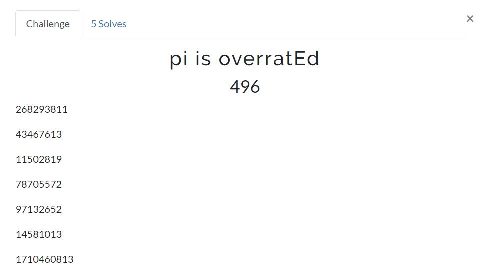

# pi is overratEd
## Des : 




## Solution

Đối với thử thách này, không có mô tả nào được đưa ra. Gợi ý duy nhất là trong tên, trong đó `E` được viết dưới dạng chữ hoa. Vì `pi` cũng được đề cập, người ta có thể kết luận rằng gợi ý chỉ ra [`số Euler`](https://en.wikipedia.org/wiki/E_(mathematical_constant)).

Ngoài ra, chỉ có một danh sách các số được đưa ra, và đó là tất cả.

```
268293811

43467613

11502819

78705572

97132652

14581013

1710460813
```

Đây có lẽ là nơi mà hầu hết các đội gặp khó khăn, bao gồm cả mình. Tìm mối liên hệ thực sự phải làm gì với tất cả những gợi ý không tồn tại đó. Bí quyết là, sử dụng các số làm chỉ số *into* `e` và phân tích chuỗi số bắt đầu từ các chỉ số này. Để làm điều này, các dịch vụ web tồn tại, chẳng hạn như [`tool này`](http://www.subidiom.com/pi/pi.asp). Chọn chế độ `Hiển thị 25 chữ số từ vị trí bắt đầu` và hằng số `E` ta tìm được dãy 25 chữ số:

```
268293811 => 1021089719722600266340076

43467613 => 0312310548810825311165920

11502819 => 1159510131964056178944953

78705572 => 9510511403237922434710706

97132652 => 1149711613193728896498249

14581013 => 0511111033100276964735988

1710460813 => 7108631254521100432595136
```

Để truy xuất cờ từ đây, các chuỗi số cần được chuyển đổi thành `ascii`. Một chút thử nghiệm và sai sót là cần thiết ở đây để chia số theo các chuỗi ascii hợp lý. Chẳng hạn, lấy `1021089719722600266340076`. Chúng ta biết rằng chúng ta đang tìm kiếm các ký tự có thể in được (rất có thể là chữ thường `'a' - 'z'` nhưng chúng ta đang tìm kiếm `37` - `126` để bao trùm phạm vi đầy đủ). Điều này có nghĩa là việc tách `1` hoặc `10` không hoạt động, mã ascii có thể in đầu tiên sẽ là `102` bằng `f`, điều tương tự cho mã tiếp theo `108` bằng `l` và `97` bằng thành `a`.

```
102,108,97,19722600266340076
```

Sau đó, trình tự không thể được phân tách thêm nữa, vì `1`, `19` và `197` nằm ngoài phạm vi có thể in mà chúng ta đang tìm kiếm. Vì vậy, chúng ta có thể kết luận phần đầu tiên là `fla` nghe có vẻ đúng.

Tiếp tục chuỗi tiếp theo `0312310548810825311165920`. `0`, `03`, `031`, `0312` đều không hoạt động, vậy chuyện gì đang xảy ra vậy? Chúng ta biết ký tự tiếp theo cần phải là `g` (chúng ta biết điều này vì chúng ta biết định dạng cờ), đó sẽ là `103`. Chuỗi của chúng ta bắt đầu bằng `03` nhưng thiếu `1`. Kiểm tra số trước đó, nó kết thúc bằng `197226...` và đó chính xác là nơi tìm thấy `1`, do đó mã ký tự *có thể* được phân chia giữa các chuỗi. Tiếp tục với sơ đồ này, chúng ta nhận được các số sau:

```
#1: 102, 108, 97, 1
#2: 03, 123, 105,
#3: 115, 95, 101,
#4: 95, 105, 114,
#5: 114, 97, 116, 1
#6: 05, 111, 110, 3
#7: 7, 108, 63, 125
```

Nếu chúng ta nối các số và chuyển đổi chúng thành ascii, chúng ta sẽ nhận được:
```
"".join(chr(c) cho c trong [102, 108, 97, 103, 123, 105, 115, 95, 101, 95, 105, 114, 114, 97, 116, 105, 111, 110, 37 , 108, 63, 125])
#flag{is_e_irration%l?}
```

Đến đây thì nhìn có vẻ đúng nhưng flag vẫn sai và giờ là đến chuyên mục guessing =))  cái `%` có vẻ ko có nghĩa cho lắm nếu nó nằm ở vị trí đó nên chúng ta có thể đoán đó là a để có nghĩa là `irrational`(không hợp lý) để tạo thành cụm là `is e irrational` (e có vô lý ko ?)

#flag : `flag{is_e_irrational?}`